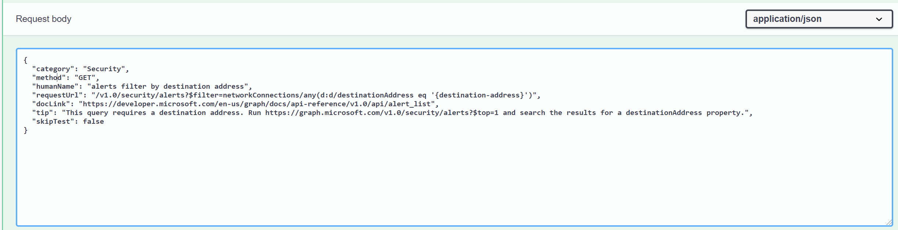
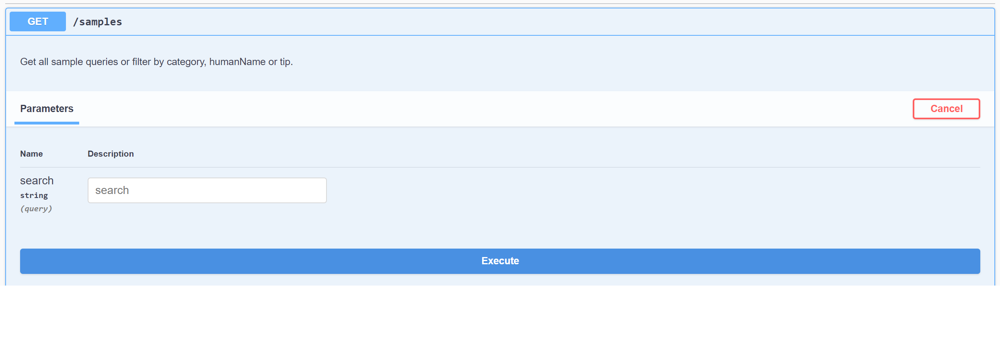

# microsoft-graph-explorer-api

## Graph Explorer API Endpoints

The Graph Explorer API is a RESTful API that exposes resources that are used by Microsoft Graph docs, Graph Explorer, Graph samples workload teams and are managed by the Graph PM team. Below is a brief description of each of the various endpoints under the Graph Explorer API.

### 1. Snippet Generator
This endpoint provides a means of getting a code snippet on how to perform a certain action on Microsoft Graph.

The API takes in the HTTP request message to be sent to Microsoft Graph and the programming language to return a response with the code snippet string.

The API currently supports the generation of snippets to the Microsoft Graph API in the following languages

- C#
- Javascript
- Objective C
- Java

### Example Snippets

- [C#](Documents/c-sharp-examples.md)
- [Javascript](Documents/javascript-examples.md)
- [Objective C](Documents/objective-c-examples.md)
- [Java](Documents/java-examples.md)

### 2. Samples
- This endpoint serves up the list of sample queries and the means of adding, updating or deleting them. 
Members from the workload teams are able to add, update or delete the sample queries with the right permissions.
The sample queries are also queryable by their *category name*, *human name* or *tip*.
- An authorized user will need to be granted permission to be able to do any POST, PUT or DELETE operations on any sample query category. The Graph PMs have the authority to grant users permissions for the write, update, delete operations of each of the sample queries categories.

### 3. Permissions
This endpoint serves up a list of scopes and their information, ordered from the least to most permissive, when given a request url, an HTTP verb/method (GET, PUT, POST, DELETE) and the scope type (DelegatedWork, DelegatedPersonal or Application). Graph Explorer uses this endpoint to render the list of sample queries on its page.

### 4. Samples Admin
This is the administrative endpoint of the API that is used by authorized Graph PMs to assign permissions to workload team members for them to be able to perform write, update and delete operations on the sample queries.

## How to use the endpoints
This API makes use of Swagger UI to expose its resources for end user consumption.
Some protected resources can be called only after a successful authentication with Azure AD.

### 1. Authorize on Swagger UI
Calling the secured resources of the API requires authentication with Azure AD.
1. Navigate to: https://graphexplorerapi.azurewebsites.net/swagger/index.html and click on the **Authorize** button. 
 
1. In the dialog window that opens, select the *scope* checkbox.
1. Choose **Authorize**.

1. You will be redirected to a separate window where you will be asked to log in with your Microsoft account and asked to grant permission to *Graph Explorer API Swagger UI*. Choose **Accept**.
1. Upon successful authorization, you will be redirected back to the Swagger UI window and you will see the below dialog. Choose **Close**.

### 3. Call the endpoints
- Click the **Try it out** button to make a call to a resource.

- For POST and PUT operations, you will be provided with an editable request body template in the *Request body* window which you can update with the details of the data you wish to send in your request. The content-type is JSON.

- Click on the **Execute** button to make the request.

- Request responses will be displayed in the *Responses* window.

## License

Copyright (c) Microsoft Corporation. All Rights Reserved. Licensed under the MIT [license](LICENSE).    