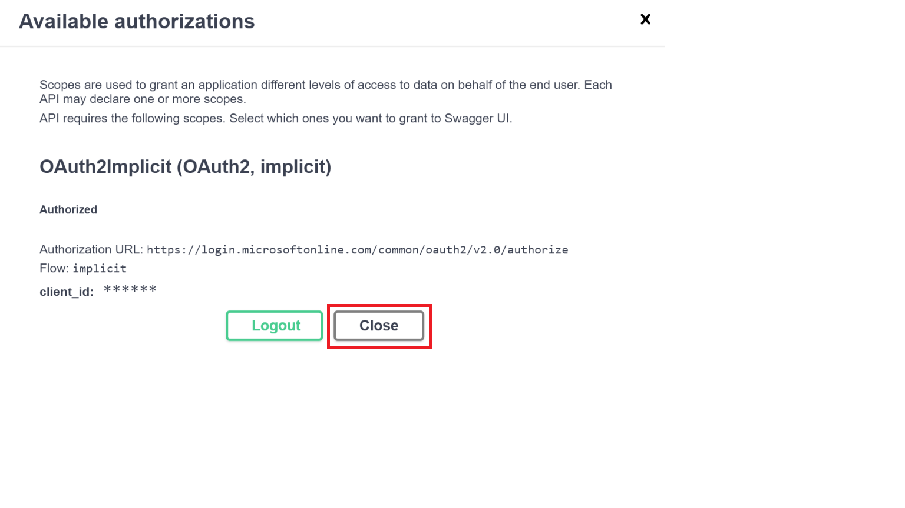

# microsoft-graph-explorer-api

## Graph Explorer API Endpoints

The Graph Explorer API is an HTTP RESTful API that exposes resources that are used by Microsoft Graph docs, Graph Explorer, Graph samples workload teams and managed by the Graph PM team. Below is a brief description of each of the various endpoints under the Graph Explorer API.

### 1. Snippet Generator
This API provides a means of getting a code snippet on how to perform a certain action on Microsoft Graph.

The API takes in the HTTP request message to be sent to Microsoft Graph and the programming language to return a response with the code snippet string.

The API currently supports the generation of snippets to the Microsoft Graph API in the following languages

- C#
- Javascript
- Objective C
- Java

### Example Snippets

- [C#](c-sharp-examples.md)
- [Javascript](javascript-examples.md)
- [Objective C](objective-c-examples.md)
- [Java](java-examples.md)

### 2. Samples
This API serves up the list of sample queries. 
Workload teams are able to add, update or delete the sample queries with the right permissions.
The sample queries are also queryable by their *category name*, *human name* or *tip*.

### 3. Permissions
This API serves up a list of scopes and their information, ordered from the least to most permissive, when given a request url. Graph Explorer uses this endpoint to render the list of sample queries.

### 4. Samples Admin
This is the administrative endpoint of the API that is used by authorized Graph PMs to assign permissions to workload teams to be able to perform write, update and delete operations on the sample queries.

## How to use the endpoints
This API makes use of Swagger UI to expose its endpoints for end user consumption.
Some Protected resources can be accessed only after a successful authentication with Azure AD.

### 1. Register an application with Azure AD

1. Navigate to the Azure portal [app registrations](https://portal.azure.com/#blade/Microsoft_AAD_IAM/ActiveDirectoryMenuBlade/RegisteredApps) page and click on **New registration**. 

1. In the window that opens, provide a suitable name under the **Name** field, e.g. *GE-API-SwaggerUI*. Under **Redirect URI**, select *Web* and paste this value: *https://graphexplorerapi.azurewebsites.net/swagger/oauth2-redirect.html*. Select **Register**.

1. In the **Overview** blade, copy the Application (client) ID and paste it somewhere you can easily access. You will use it during authorization on Swagger UI.

### 2. Authorize on Swagger UI
1. Navigate to: https://graphexplorerapi.azurewebsites.net/swagger/index.html and Click on **Authorize**. 

1. Insert the Application (client) ID in the provided text box for client id. 
1. Select the *scope* checkbox.
1. Choose **Authorize**

1. You will be redirected to a separate page where you will be asked to log in to your Microsoft account. Log in with the account that you used to register the previous application on Azure AD.
1. Upon successful authorization, you will be redirected back to the Swagger UI and you will see the below window. Choose **Close**.

### 3. Call the endpoints

## License

Copyright (c) Microsoft Corporation. All Rights Reserved. Licensed under the MIT [license](LICENSE).