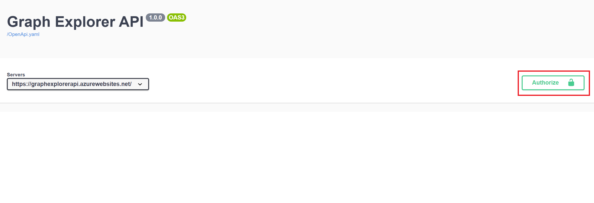
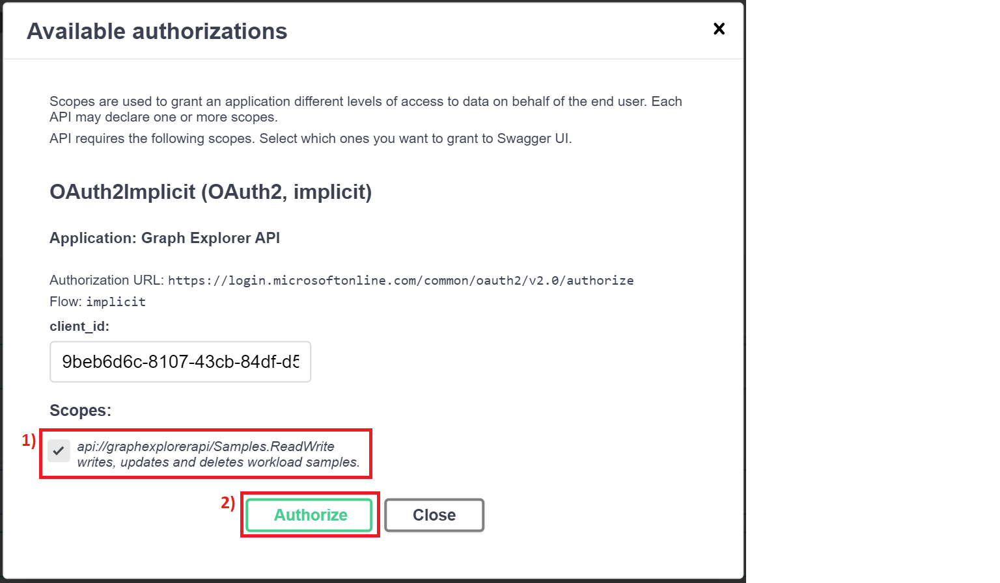
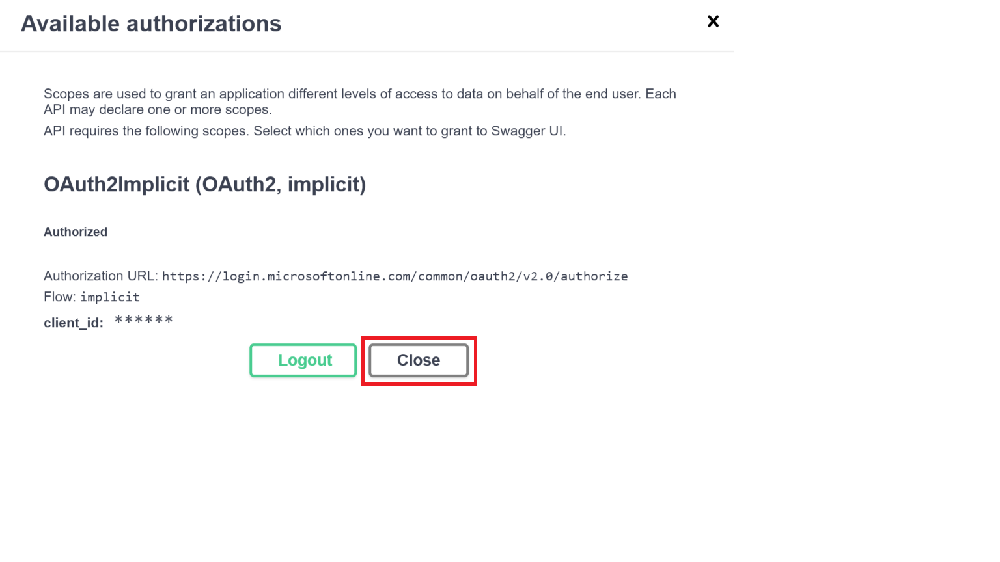
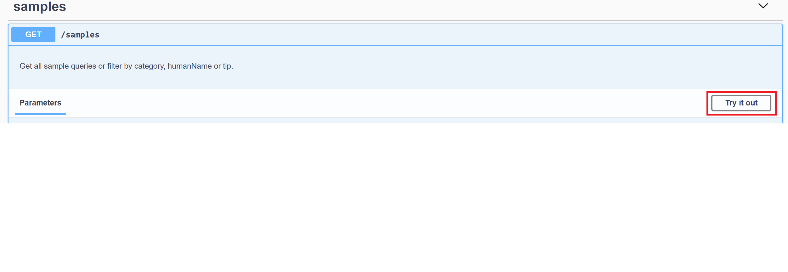
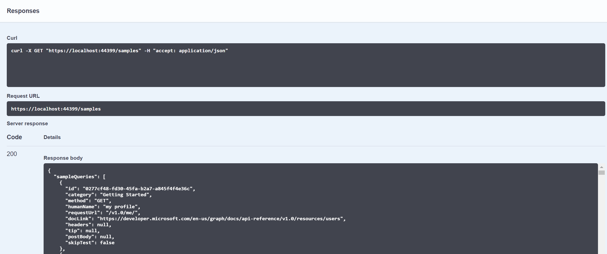

# microsoft-graph-devx-api
[](https://sonarcloud.io/dashboard?id=microsoftgraph_microsoft-graph-devx-api) [](https://sonarcloud.io/dashboard?id=microsoftgraph_microsoft-graph-devx-api)

## About the project/repo
The Graph DevX API is a backend RESTful API that primarily exposes resources that are consumed by [Microsoft Graph documentation](https://docs.microsoft.com/graph/), [Graph Explorer](https://developer.microsoft.com/en-us/graph/graph-explorer), [Powershell sdk](https://github.com/microsoftgraph/msgraph-sdk-powershell) and Graph samples workload teams which are managed by the Graph PM team.
It serves up a list of the following resources:

- Sample Queries: A set of queries that you can run against [Microsoft Graph](https://docs.microsoft.com/en-us/graph/overview).
- Permissions: a set of permissive scopes for running different queries on [Graph Explorer](https://developer.microsoft.com/en-us/graph/graph-explorer) for different APIs.
- OpenAPI Descriptions: OpenAPI definitions for APIs within MS Graph which are used by [Graph Explorer](https://developer.microsoft.com/en-us/graph/graph-explorer) and [Powershell sdk](https://github.com/microsoftgraph/msgraph-sdk-powershell).
- Changes: [Changelog info](https://developer.microsoft.com/en-us/graph/changelog) for Microsoft Graph versions v1.0 and beta.
- Known Issues: A list of [known issues](https://docs.microsoft.com/en-us/graph/known-issues) for Graph and the statuses of the issues.

## Overview
DevX API is a collection of the following endpoints for different services:

### 1. Snippet Generator
This endpoint provides a means of getting a code snippet on how to perform a certain action on Microsoft Graph.
The API takes in the HTTP request message to be sent to Microsoft Graph and the programming language to return a response with the code snippet string.
The API currently supports the generation of snippets to the Microsoft Graph API in the following languages:
- [C#](Documents/c-sharp-examples.md)
- [Javascript](Documents/javascript-examples.md)
- [Java](Documents/java-examples.md)
- Go
- PowerShell
- TypeScript

### 2. Samples
This endpoint serves up the list of sample queries queryable by their *category name*, *human name* or *tip*.
Once they are checked in through the [DevX Content Repo](https://github.com/microsoftgraph/microsoft-graph-devx-content), DevX API fetches the samples and feeds them to [Graph Explorer](https://developer.microsoft.com/en-us/graph/graph-explorer) for users to run their queries.

### 3. Permissions
This endpoint serves up a list of scopes and their information, ordered from the least to most permissive, when given a request url, an HTTP verb/method (GET, PUT, POST, DELETE) and the scope type (DelegatedWork, DelegatedPersonal or Application). [Graph Explorer](https://developer.microsoft.com/en-us/graph/graph-explorer) uses this endpoint to render the list of sample queries on the UI.

### 4. Changes
The Changes endpoint will be used primarily by [Graph Explorer](https://developer.microsoft.com/en-us/graph/graph-explorer) to surface changelog info. The changelog info describes Microsoft Graph API endpoint changes that have occurred in both V1.0 and Beta. [Graph Explorer](https://developer.microsoft.com/en-us/graph/graph-explorer) will call this Changelog endpoint to retrieve any changelog info. associated with a particular Microsoft Graph endpoint.
Changelog info can be retrieved by:
- Microsoft Graph url
- Workload name
- Dates
- Number of days
- The response can also be paginated.

### 5. Known Issues
Surfaces a list of known issues with MS Graph from different workloads and teams, for better tracking and keeping the known issues upto date.

### 6. Open API
The OpenAPI endpoint takes in clean Graph metadata in csdl format and converts it to relevant Open API descriptions using the OpenAPI specification standard.
Its is used by:
- [Powershell sdk](https://github.com/microsoftgraph/msgraph-sdk-powershell) to generate modules and commands for making calls against Graph.
- [Graph Explorer](https://developer.microsoft.com/en-us/graph/graph-explorer) to populate the autocomplete component with available query param results when running sample queries.

## Getting Started
1. Clone the repo into your local machine by running this command:

    ```(git clone https://github.com/microsoftgraph/microsoft-graph-devx-api.git)```

2. Open the ```solution file(.sln)``` in the root of the project with Visual Studio and set the GraphWebAPI as the launch project.


3. Run the app: ``` https://localhost:44399/``` and call the different endpoints

## Usage
This API makes use of Swagger UI to expose its resources for end user consumption.
Some protected resources can be called only after a successful authentication with Azure AD.

### 1. Authorize on Swagger UI
Calling the secured resources of the API requires authentication with Azure AD.
1. Navigate to: https://graphexplorerapi.azurewebsites.net/swagger/index.html and click on the **Authorize** button.

1. In the dialog window that opens, select the *scope* checkbox.
1. Choose **Authorize**.

1. You will be redirected to a separate window where you will be asked to log in with your Microsoft account and asked to grant permission to *Graph Explorer API Swagger UI*. Choose **Accept**.
1. Upon successful authorization, you will be redirected back to the Swagger UI window and you will see the below dialog. Choose **Close**.


### 2. Call the endpoints
- Click the **Try it out** button to make a call to a resource.


- Input your parameters and click on the **Execute** button to make the request.


- Request responses will be displayed in the *Responses* window.


## Versioning Schema
Our versioning schema is tied to our default date-based build version in our build pipeline whose format is ```(v$(Build.BuildNumber)-$(Build.BuildId))```

- [Release notes](https://github.com/microsoftgraph/microsoft-graph-devx-api/releases)

## Contribute
### Pre-requisites:

- Download and Install Git to your machine https://git-scm.com/downloads
- Download and Install VS Code to your machine https://code.visualstudio.com/download

### Steps:
1. Fork/Clone the repo into your local machine
2. Create a new branch
3. Make changes
4. Create a PR against dev branch

## Related Repos
- [DevX Content Repo](https://github.com/microsoftgraph/microsoft-graph-devx-content)
- [Permissions Scraper](https://github.com/microsoftgraph/msgraph-permissions-scraper)
- [OpenAPI.NET.OData](https://github.com/microsoftgraph/OpenAPI.NET.OData)
- [OpenAPI.NET](https://github.com/Microsoft/OpenAPI.NET)

## Resources and Documentation
- [Graph API documentation](https://docs.microsoft.com/en-us/graph/overview)
- [Swagger documentation](https://swagger.io/docs/)
- [OpenAPI documentation](https://spec.openapis.org/oas/latest.html#openapi-document)

## Security Reporting
For any security loophole, kindly report to https://aka.ms/report-security-issue

## Open Source Code of Conduct
For open-source contribution guidelines documentation, take a lot at the following resources:
- https://opensource.microsoft.com/codeofconduct/

- https://opensource.microsoft.com/codeofconduct/faq/

- Contact: opencode@microsoft.com

## License
Copyright (c) Microsoft Corporation. All Rights Reserved. Licensed under the MIT [license](LICENSE).
